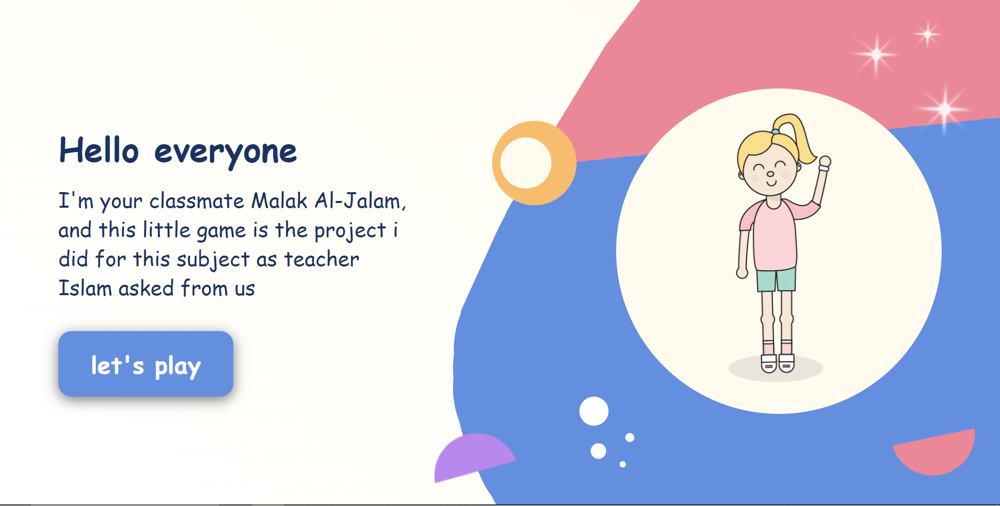

 <h1>Questions game</h1>
 

A simple game I made for a tenth-grade computer science project. In the game, a student spins a wheel to select a question, each of which is represented by a specific color. After the question is revealed, the student who spun the wheel listens to their classmates' answers. They can then indicate whether the answer is true or false by clicking on the corresponding buttons. This process continues until all questions have been answered. Finally, upon completing all questions, a congratulatory message pops up.

 
<h2>Screenshots:</h2>

